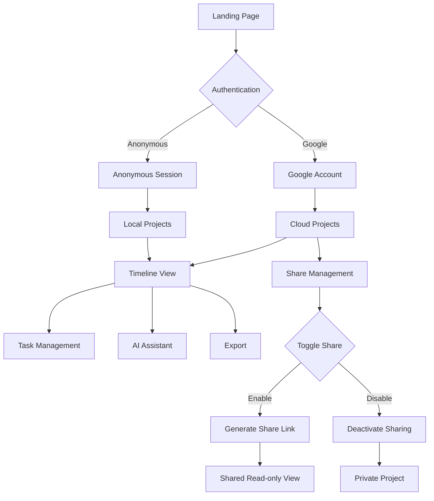

# Dokumen Requirement: Refactor Timeline Proyek ke React

## 1. Product Overview

Refactor aplikasi Timeline Proyek dari HTML vanilla ke React dengan shadcn/ui untuk meningkatkan maintainability, developer experience, dan user interface yang lebih modern. Aplikasi ini memungkinkan pengguna membuat dan mengelola timeline proyek dengan visualisasi yang interaktif, dilengkapi AI assistant untuk produktivitas yang lebih tinggi.

- Memecahkan masalah pengelolaan proyek yang kompleks dengan visualisasi timeline yang mudah dipahami
- Target pengguna: project manager, tim development, dan individu yang mengelola proyek
- Memberikan nilai dengan automation AI dan kemudahan sharing proyek

## 2. Core Features

### 2.1 User Roles

| Role | Registration Method | Core Permissions |
|------|---------------------|------------------|
| Anonymous User | Firebase Anonymous Authentication | Can create and manage projects, limited to local session |
| Google User | Firebase Google Authentication | Full access to all features, data synced across devices |
| Linked User | Account linking from anonymous to Google | Retains all anonymous data + Google account benefits |
| Viewer | Access via shared link | Read-only access to shared projects |

### 2.2 Feature Module

Aplikasi timeline proyek terdiri dari halaman-halaman utama berikut:

1. **Dashboard**: project selector, empty state, navigation menu
2. **Timeline View**: timeline visualization, task management, view controls (daily/weekly/monthly)
3. **Project Management**: create/edit/delete project, project settings, share control
4. **AI Assistant**: chat interface, task automation, project analysis
5. **Export & Share**: PNG/PDF export, project sharing functionality
6. **Authentication**: anonymous login, Google login, user status management

### 2.3 Page Details

| Page Name | Module Name | Feature description |
|-----------|-------------|---------------------|
| Dashboard | Project Selector | Display project dropdown, handle project selection, show empty state when no projects |
| Dashboard | Navigation Header | Show app title, project actions (create, edit, delete), responsive layout |
| Timeline View | Timeline Grid | Render timeline with tasks, support daily/weekly/monthly views, interactive task bars |
| Timeline View | Task Management | Add new tasks, edit existing tasks, toggle completion status, delete tasks |
| Timeline View | View Controls | Switch between daily/weekly/monthly timeline views, reset tasks functionality |
| Timeline View | AI Summary Card | Display AI-generated project summary, auto-update when tasks change |
| Authentication | Anonymous Login | Firebase anonymous authentication for quick access without registration |
| Authentication | Google Login | Firebase Google authentication for data synchronization across devices |
| Authentication | Account Linking | Prompt anonymous users to link Google account, seamless data migration |
| Authentication | User Status | Display login status, user information, and logout options |
| Project Management | Project CRUD | Create new project with name and description, edit project details, delete project with confirmation |
| Project Management | Project Settings | Manage project metadata, handle project validation |
| Project Management | Share Control | Toggle project sharing on/off, manage sharing status and permissions |
| AI Assistant | Chat Interface | Real-time chat with AI, message history, typing indicators, error handling |
| AI Assistant | Task Automation | AI-powered task creation, project analysis, natural language processing |
| AI Assistant | Smart Suggestions | Context-aware responses, project insights, productivity recommendations |
| Export & Share | Export Functions | Generate PNG/PDF exports of timeline, download functionality, print optimization |
| Export & Share | Sharing System | Create shareable links, public project access, read-only mode for shared projects |

## 3. Core Process

**Anonymous User Flow:**
1. User mengakses aplikasi dan login anonim otomatis
2. User membuat proyek dan mengelola tugas (data tersimpan lokal session)
3. User dapat menggunakan semua fitur kecuali sinkronisasi lintas perangkat

**Google User Flow:**
1. User login dengan akun Google untuk akses penuh
2. User membuat/mengelola proyek dengan sinkronisasi cloud
3. User dapat mengaktifkan/menonaktifkan sharing proyek
4. User mengelola link sharing dan status berbagi

**Account Linking Flow:**
1. Anonymous user creates projects and tasks
2. User decides to sign in with Google account
3. System prompts for account linking confirmation
4. Firebase Auth links anonymous account to Google account
5. All existing projects and tasks remain accessible
6. User gains Google account benefits while retaining anonymous data
7. Future sessions use Google authentication with full data access

**Sharing Management Flow:**
1. User mengaktifkan sharing untuk proyek tertentu
2. System generate link sharing yang dapat dibagikan
3. User dapat menonaktifkan sharing kapan saja
4. User dapat mengaktifkan kembali sharing dengan link yang sama
5. Viewer mengakses proyek melalui shared link (read-only)

## 4. User Interface Design

### 4.1 Design Style

- **Primary Colors**: Indigo (#4f46e5) untuk primary actions, Gray (#6b7280) untuk secondary
- **Secondary Colors**: Green (#10b981) untuk success, Red (#ef4444) untuk danger, Yellow (#f59e0b) untuk warning
- **Button Style**: Rounded corners (0.5rem), subtle shadows, hover animations dengan transform
- **Font**: Inter font family, sizes 0.8rem-3rem, weights 400-700
- **Layout Style**: Card-based design dengan shadows, responsive grid layout, top navigation
- **Icons**: Heroicons untuk konsistensi, emoji support untuk AI chat

### 4.2 Page Design Overview

| Page Name | Module Name | UI Elements |
|-----------|-------------|-------------|
| Dashboard | Project Selector | Dropdown select dengan border-gray-300, focus states indigo, responsive width |
| Dashboard | Header Actions | Flex layout dengan gap, responsive button groups, primary button styling |
| Timeline View | Timeline Grid | CSS Grid dengan sticky headers, overflow-x auto, task bars dengan hover effects |
| Timeline View | Task Bars | Colored backgrounds, border-left accent, hover transform, tooltip dengan dark theme |
| Timeline View | View Controls | Button group dengan active states, rounded corners, secondary styling |
| Timeline View | Task Management | Task bars dengan tooltip, modal forms untuk add/edit, drag & drop functionality |
| Timeline View | Export Controls | Button group untuk PNG/PDF export, loading states, success notifications |
| Timeline View | AI Chat | Floating chat button, slide-in chat panel, message bubbles, typing indicators |
| Authentication | Login Options | Card layout dengan anonymous dan Google login buttons, user avatar/status indicator |
| Authentication | User Profile | Dropdown menu dengan user info, logout option, account type indicator |
| Authentication | Account Linking | Notification banner for anonymous users, link account button, success confirmation |
| Share Management | Share Toggle | Switch component untuk enable/disable sharing, status badge |
| Share Management | Share Link | Input field dengan copy button, QR code generator, access statistics |
| AI Assistant | Chat Window | Fixed position bottom-right, card styling, smooth animations, bubble design |
| AI Assistant | Chat Bubbles | Different colors untuk user/assistant/error, rounded corners, timestamp display |
| Export & Share | Modal Dialogs | Centered overlay dengan backdrop blur, card styling, responsive width |
| Project Management | Form Inputs | Consistent border-gray-300, focus:border-indigo-500, padding 0.5rem |

### 4.3 Responsiveness

Aplikasi menggunakan mobile-first responsive design dengan breakpoints:
- Mobile: < 640px (stack layout, simplified navigation)
- Tablet: 640px - 1024px (adaptive grid, collapsible sidebar)
- Desktop: > 1024px (full layout dengan sidebar, optimal spacing)

Touch interaction optimization untuk mobile devices dengan larger touch targets dan gesture support.